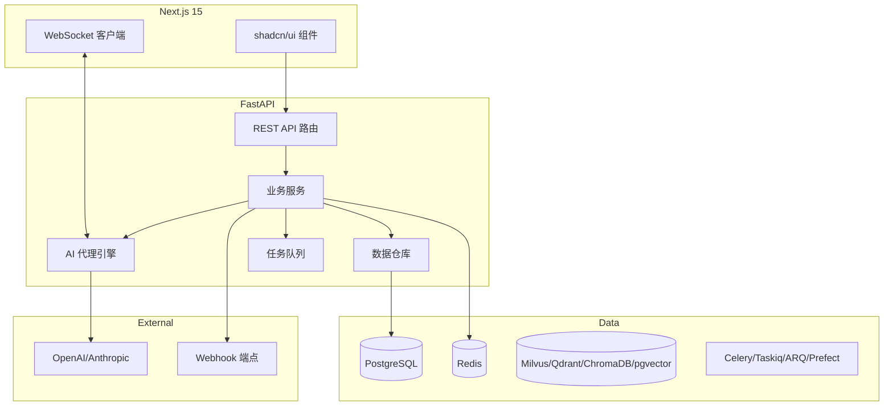
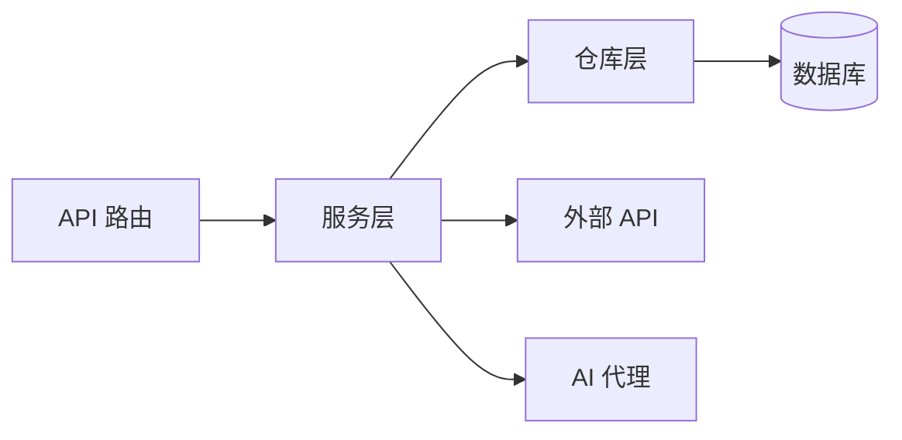
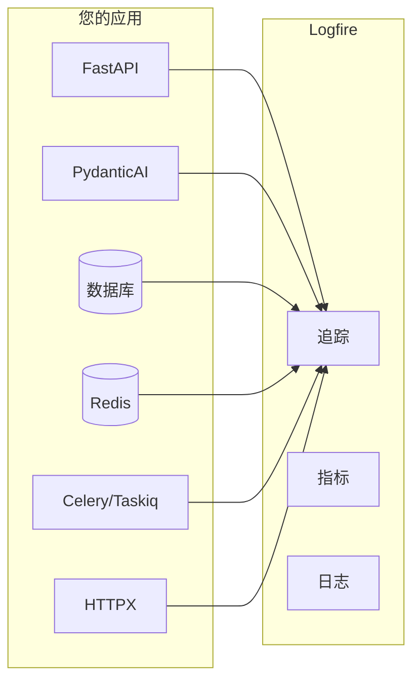

<h1 align="center">全栈 AI 代理模板</h1>

<p align="center">
  <i>生产就绪的 FastAPI + Next.js 项目生成器，支持 AI 代理、RAG 和 20+ 企业级集成。</i>
</p>

<p align="center">
  <a href="#-quick-start">快速开始</a>
  <a href="#-demo">演示</a>
  <a href="#-screenshots">截图</a>
  <a href="https://vstorm-co.github.io/framework-agent-python/">文档</a>
  <a href="https://oss.vstorm.co/projects/framework-agent-python/configurator/">配置器</a>
  <a href="https://pypi.org/project/framework-agent-python/">PyPI</a>
</p>

<p align="center">
  <a href="https://pypi.org/project/framework-agent-python/"></a>
  <a href="https://pepy.tech/projects/framework-agent-python"></a>
  <a href="https://github.com/vstorm-co/framework-agent-python/stargazers"></a>
  <a href="https://www.python.org/"></a>
  <a href="https://github.com/vstorm-co/framework-agent-python/blob/main/LICENSE"></a>
  
  <a href="https://github.com/vstorm-co/framework-agent-python/actions/workflows/ci.yml"></a>
  <a href="https://github.com/vstorm-co/framework-agent-python/blob/main/SECURITY.md"></a>
  <a href="https://www.bestpractices.dev/projects/12539"></a>
  <a href="https://github.com/pydantic/pydantic-ai"></a>
  <a href="https://x.com/Kacper95682155"></a>
</p>

<p align="center">
  
</p>

<p align="center">
  <b>🎮 6 个 AI 代理框架</b> <i>（PydanticAI、PydanticDeep、LangChain、LangGraph、DeepAgents、AgentScope）</i>
  <br>
  <b>📫 RAG 管道</b> <i>（Milvus、Qdrant、pgvector、ChromaDB）</i>
  <br>
  <b>⚡ FastAPI + Next.js 15</b> <i>（WebSocket 流式传输、实时聊天 UI）</i>
  <br>
  <b>💆 对话分享</b> <i>（直接分享、公开链接、管理员浏览器）</i>
  <br>
  <b>🔥 企业就绪</b> <i>（JWT、OAuth、管理面板、Celery、Docker、K8s）</i>
</p>

<details>
<summary><b>目录</b></summary>

- [快速开始](#-quick-start)
- [演示](#-demo)
- [截图](#-screenshots)
- [为什么选择这个模板](#-why-this-template)
- [功能特性](#-features)
- [架构](#-architecture)
- [AI 代理](#-ai-agent)
- [RAG（检索增强生成）](#-rag-retrieval-augmented-generation)
- [可观测性](#-observability)
- [Django 风格 CLI](#-django-style-cli)
- [生成的项目结构](#-generated-project-structure)
- [配置选项](#-configuration-options)
- [对比](#-comparison)
- [常见问题](#-faq)
- [文档](#-documentation)
- [贡献](#-contributing)

</details>

---

## Vstorm OSS 生态系统

本模板是更广泛的生产级 AI 代理开源生态系统的一部分：

| 项目 | 描述 | |
|---------|-------------|---|
| **[pydantic-deepagents](https://github.com/vstorm-co/pydantic-deepagents)** | Python 模块化代理运行时。Claude Code 风格 CLI，带 Docker 沙箱、浏览器自动化、多代理团队和 /improve。 | [](https://github.com/vstorm-co/pydantic-deepagents) |
| **[pydantic-ai-shields](https://github.com/vstorm-co/pydantic-ai-shields)** | Pydantic AI 代理的即插即用护栏。5 个基础设施 + 5 个内容防护。 | [](https://github.com/vstorm-co/pydantic-ai-shields) |
| **[pydantic-ai-subagents](https://github.com/vstorm-co/pydantic-ai-subagents)** | 声明式多代理编排，带令牌追踪。 | [](https://github.com/vstorm-co/pydantic-ai-subagents) |
| **[summarization-pydantic-ai](https://github.com/vstorm-co/pydantic-ai-summarization)** | 长时间运行代理的智能上下文压缩。 | [](https://github.com/vstorm-co/summarization-pydantic-ai) |
| **[pydantic-ai-backend](https://github.com/vstorm-co/pydantic-ai-backend)** | AI 代理的沙箱执行环境。Docker + Daytona。 | [](https://github.com/vstorm-co/pydantic-ai-backend) |

> **想要这个模板中 AI 代理背后的运行时？** [pydantic-deepagents](https://github.com/vstorm-co/pydantic-deepagents) 驱动 `deepagents` 框架选项 — 独立安装：`curl -fsSL .../install.sh | bash`。

浏览所有项目请访问 [oss.vstorm.co](https://oss.vstorm.co)

---

## 🚀 快速开始

> [!TIP]
> **更喜欢可视化配置器？** 使用 [Web 配置器](https://oss.vstorm.co/projects/framework-agent-python/configurator/) 在浏览器中配置项目并下载 ZIP — 无需安装 CLI。

### 安装

```bash
# pip
pip install framework-agent-python

# uv（推荐）
uv tool install framework-agent-python

```bash
# pipx
pipx install framework-agent-python
```

### 从零到运行应用

三个步骤。向导创建项目结构，`make bootstrap` 启动整个后端，前端用一个命令运行：

```bash
# 1. 生成您的项目 — 只需回答向导的提示
framework-agent-python

# 2. 后端 + PostgreSQL 启动，迁移已应用，默认管理员已创建
cd my_ai_app
make bootstrap

# 3. 前端（在第二个终端中）
cd frontend && bun install && bun dev
```

> **`make bootstrap` 的作用**（= `make dev` + `make seed`）：构建后端 Docker 镜像，通过 `docker-compose.dev.yml` 启动栈，等待 PostgreSQL（`pg_isready`），应用 Alembic 迁移，并创建 `admin@example.com` / `admin123`。它是幂等的 — 可随时重新运行。

**然后访问：**

| | URL | |
|---|---|---|
| 后端 API | <http://localhost:8000> | |
| 文档 | <http://localhost:8000/docs> | OpenAPI / Swagger |
| 管理后台 | <http://localhost:8000/admin> | `admin@example.com` / `admin123`（执行 `make seed` 后） |
| 前端 | <http://localhost:3000> | `make dev-frontend`（Docker）或 `cd frontend && bun install && bun dev`（本地） |

### 日常命令

```bash
make dev           # 启动或重启（不重新创建管理员）
make seed          # 一次性管理员创建（如已存在则跳过）
make dev-down      # 停止所有服务
make dev-logs      # 查看容器日志
make dev-rebuild   # 强制重建后端镜像（pyproject.toml 变更后）
make dev-frontend  # 启动 Next.js 容器
```

首次 `make bootstrap` 后，日常只需运行 `make dev`（跳过管理员重新创建）。在项目内运行 `make help` 查看完整列表。

<details>
<summary><b>其他生成方式（标志、预设、最小化）</b></summary>

跳过向导直接传递选项：

```bash
# 非交互式，带明确选项
framework-agent-python create my_ai_app --database postgresql --frontend nextjs

# 常见场景的预设（运行 `framework-agent-python templates` 查看完整列表）
framework-agent-python create my_ai_app --preset ai-agent           # AI 代理带流式传输
framework-agent-python create my_ai_app --preset production         # 完整生产设置
framework-agent-python create my_ai_app --preset production-saas    # SaaS：计费、团队、管理

# 极简项目（PostgreSQL，无 Docker/Redis/CI）
framework-agent-python create my_ai_app --minimal
```

</details>

### 保持项目最新

您的项目不会停留在生成时的模板版本上。将最新的模板改进拉取到现有项目中，使用真正的三方合并 — 您的自定义内容被保留，冲突留给您在自己的 IDE 中解决，整个过程在专用分支上完成，完全可逆：

```bash
make upgrade-dry-run     # 预览将要变更的内容（不进行任何更改）
make upgrade             # 在 `template-upgrade/v<版本>` 分支上应用
# 在 IDE 的三方合并编辑器中解决任何冲突，然后：
make upgrade-finalize    # 将清单升级到新版本

# 仅您修改过的文件被保留，仅模板修改过的文件被更新，新功能/迁移被拉取。默认情况下升级保留您现有的功能集 — 同时采用自您版本以来新增的可选功能，请使用：
make upgrade-new-features   # 为每个新的可选功能提示是/否

# 一次性标志（例如固定目标版本）通过 `ARGS` 传递，您也可以直接调用 CLI 而非 `make`：
make upgrade ARGS=--to=0.3.0
uvx framework-agent-python@latest upgrade --with-new-features
```

详见[版本升级指南](docs/guides/version-upgrade.md)的完整操作说明（包括在升级支持存在之前生成的项目）。

### 环境

| `make` 目标 | Compose 文件 | 使用时机 |
|---|---|---|
| `make dev` | `docker-compose.dev.yml` | 本地开发，带热重载 + 绑定挂载源码。 |
| `make stage` | `docker-compose.yml` | 类似生产环境的构建（无绑定挂载）在 localhost 上运行。部署前做完整性检查。 |
| `make prod` | `docker-compose.prod.yml` | 生产环境。需要 `backend/.env`（从 `backend/.env.example` 复制，填写真实密钥）+ 使用 `nginx/nginx.conf` 的外部 Nginx。 |

每个环境都有对应的 `-down`、`-logs`、`-rebuild` 配套命令。

> [!NOTE]
> **Windows 用户：** `make` 需要 GNU Make。通过 [Chocolatey](https://chocolatey.org/) 安装（`choco install make`）或使用 **WSL2 / Git Bash**。Docker 工作流在 macOS、Linux 和 WSL2 上相同。

<details>
<summary><b>本地后端（无需 Docker，用于 IDE 断点调试）</b></summary>

如果您希望在主机上运行后端而数据库保留在 Docker 中：

```bash
cd my_ai_app
make install                                                # uv sync + pre-commit 钩子

# 仅启动基础设施容器
docker compose -f docker-compose.dev.yml up -d db redis    # 如果使用 RAG 则添加 milvus etcd minio

make db-upgrade                                             # 应用迁移
make create-admin                                           # 交互式
make run                                                    # uvicorn --reload
```

</details>

<details>
<summary><b>生产部署</b></summary>

```bash
# 在您的服务器上
git clone <your-repo>
cd my_ai_app

cp backend/.env.example backend/.env            # 填写真实密钥
# 使用 nginx/nginx.conf 作为参考配置您的 nginx 主机

make prod                                       # 构建 + 启动 + 迁移
make prod-logs                                  # 查看日志
```

前端部署到 **Vercel**：

```bash
cd frontend && npx vercel --prod
```

在 Vercel 仪表板中设置 `BACKEND_URL`、`BACKEND_WS_URL`、`NEXT_PUBLIC_AUTH_ENABLED=true`。

</details>

### 使用项目 CLI

每个生成的项目都有一个以 `project_slug` 命名的 CLI。例如，如果您创建了 `my_ai_app`：

```bash
cd backend

# CLI 命令格式为：uv run <project_slug> <command>
uv run my_ai_app server run --reload     # 启动开发服务器
uv run my_ai_app db migrate -m "message" # 创建迁移
uv run my_ai_app db upgrade              # 应用迁移
uv run my_ai_app user create-admin       # 创建管理员用户
```

运行 `make help` 查看所有可用的 Makefile 快捷方式。

---

## 🎬 演示

**CLI 生成器** — 在 60 秒内配置并搭建一个全栈 AI 项目：


<table>
<tr>
<td width="50%">

**AI 聊天** — 流式响应、工具调用、推理和询问用户暂停：


</td>
<td width="50%">

**RAG 导入** — 拖放文档，观察其被分块、嵌入并基于它回答问题：


</td>
</tr>
</table>

**生成的营销站点** — 包含英雄区、定价、博客和法律页面的公开落地页（`enable_marketing_site`）：


---

## 📳 截图

### AI 聊天

聊天 UI 通过 WebSocket 流式传输响应，并将每个工具调用渲染为专用卡片。

<table>
<tr>
<td width="50%">

**计划和任务** — 代理按步骤工作时实时更新的粘性清单。


</td>
<td width="50%">

**子代理** — 实时信息流和侧面板，显示每个子代理的状态和消息。


</td>
</tr>
<tr>
<td width="50%">

**图表** — 交互式柱状图/面积图/折线图/饼图/散点图，内联渲染。


</td>
<td width="50%">

**代码执行** — `run_python` 在可折叠卡片中显示代码 + 标准输出/结果。


</td>
</tr>
<tr>
<td width="50%">

**询问用户** — 代理暂停以提出澄清问题；卡片保留完整记录。


</td>
<td width="50%">

**推理** — 清晰的思考视图 + 已回答问题历史，用于较长的代理轮次。


</td>
</tr>
</table>

### 认证与仪表板

<table>
<tr>
<td width="50%">

**登录** — 分屏显示，支持 Google OAuth + 邮箱/密码，HTTP-only cookie 会话。


</td>
<td width="50%">

**注册** — 同样分屏布局，包含确认密码和条款接受。


</td>
</tr>
<tr>
<td width="50%">

**仪表板（亮色）** — 统计卡片、使用时间线、最近活动、引导横幅。


</td>
<td width="50%">

**仪表板（暗色）** — 同一视图的暗色主题；按设备保存。


</td>
</tr>
</table>

### 团队与知识库

<table>
<tr>
<td width="50%">

**工作区** — 所有组织的列表，显示计划层级和角色；切换或创建新工作区。


</td>
<td width="50%">

**团队管理** — 工作区资料、成员列表及角色、邀请按钮。


</td>
</tr>
<tr>
<td width="50%">

**知识库** — RAG 集合列表；切换激活的知识库、上传文档。


</td>
<td width="50%">

**文档与同步源** — 预览文件、管理 Google Drive/S3 连接器、查看运行日志。


</td>
</tr>
</table>

### 计费与用量

<table>
<tr>
<td width="50%">

**计费概览** — 当前计划、席位、存储用量、客户门户链接。


</td>
<td width="50%">

**用量图表** — 每日积分消耗 + 调用次数图表，按模型划分的令牌消耗详情。


</td>
</tr>
<tr>
<td width="50%">

**积分** — 余额、不可变的交易分类账、用量迷你图。


</td>
<td width="50%">

**订阅与发票** — 计划管理、发票列表、支付方式 — 全部通过 Stripe。


</td>
</tr>
</table>

### 个人资料与设置

<table>
<tr>
<td width="50%">

**个人资料** — 头像上传、显示名称、邮箱、活动会话，支持每设备撤销。


</td>
<td width="50%">

**账户与安全** — 密码更改、"全局登出"、账户删除区域。


</td>
</tr>
<tr>
<td width="50%">

**斜杠命令** — 切换内置命令，为聊天面板创建自定义提示快捷方式。


</td>
<td width="50%">

**外观** — 亮色/暗色/系统主题 + 品牌颜色选择器（5 种预设，按设备保存）。


</td>
</tr>
</table>

### 管理面板

<table>
<tr>
<td width="50%">

**概览** — 工作区范围指标（用户、会话、对话、MRR）+ 活动信息流。


</td>
<td width="50%">

**用户管理** — 按邮箱/姓名搜索、角色、状态、注册日期，支持查看/暂停操作。


</td>
</tr>
<tr>
<td width="50%">

**对话浏览器** — 按状态/所有者筛选，以只读模式打开任意对话。


</td>
<td width="50%">

**消息评分** — 通过率、每日图表、可筛选的评分表及评论。


</td>
</tr>
<tr>
<td width="50%">

**Stripe 事件日志** — Webhook 事件浏览器，支持手动重放以进行调试。


</td>
<td width="50%">

**系统健康** — 实时就绪检查：API、数据库、Redis、向量存储、LLM、Worker、Stripe。


</td>
</tr>
</table>

### 营销站点

<table>
<tr>
<td width="50%">

**定价** — 三层页面，带月付/年付切换；实时拉取 Stripe 计划数据。


</td>
<td width="50%">

**博客** — 来自 MDX 文件的技术博客；标签、精选文章、作者署名。无需 CMS。


</td>
</tr>
</table>

### 后台任务、可观测性与渠道

<table>
<tr>
<td width="50%">

**Prefect** — 自托管服务器，按 cron 调度执行 RAG、计费和邮件流程。


</td>
<td width="50%">

**Prefect 流程运行** — 每次运行的详细历史、任务时间线和重试可见性。


</td>
</tr>
<tr>
<td width="50%">

**Logfire** — 分布式追踪：FastAPI、PydanticAI、数据库、Redis、Celery、HTTPX 在同一时间线中。


</td>
<td width="50%">

**LangSmith** — LangChain/LangGraph 的追踪查看器：链、令牌用量、反馈。


</td>
</tr>
<tr>
<td width="50%">

**Telegram 机器人** — 多机器人、轮询 + Webhook、按线程会话、组并发控制。


</td>
<td width="50%">

**API 文档** — 自动生成的 OpenAPI / Swagger UI，包含 schema、认证和示例请求体。


</td>
</tr>
</table>

---

## 🎯 为什么选择这个模板

构建 AI/LLM 应用需要的不仅仅是 API 封装层。您需要：

- **类型安全的 AI 代理**，支持工具/函数调用
- **通过 WebSocket 的实时流式传输**响应
- **对话持久化**和历史管理
- **生产基础设施** — 认证、速率限制、可观测性
- **企业集成** — 后台任务、Webhook、管理面板

本模板为您提供所有这些开箱即用的功能，**20+ 可配置集成**，让您可以专注于构建 AI 产品，而非样板代码。

### 适合场景

- 🎮 **AI 聊天机器人与助手** — PydanticAI 或 LangChain 代理，带流式响应
- 📳 **机器学习应用** — 使用 Celery/Taskiq 处理后台任务
- 🌚 **企业 SaaS** — 完整认证、管理面板、Webhook 等
- 🚀 **初创公司** — 使用生产就绪的基础设施快速交付

### AI 代理友好

生成的项目包含针对 AI 编码助手（Claude Code、Codex、Copilot、Cursor、Zed）优化的 **CLAUDE.md** 和 **AGENTS.md** 文件。遵循[渐进式披露](https://humanlayer.dev/blog/writing-a-good-claude-md)最佳实践 — 简洁的项目概览，需要时提供指向详细文档的指引。

同时还附带一个开箱即用的 **`.claude/` 工具包**，根据您选择的选项自适应：

- **代理技能**（`.claude/skills/`）— 模型调用的行动手册，相关时自动触发：`alembic-migration`、`pytest-suite`、`agent-tool`（框架感知）、`frontend-feature`、`rag-knowledge`、`background-task`（队列感知）、`billing-stripe` 和 `channel-bot`。按功能控制 — 仅生成与您堆栈匹配的技能。
- **斜杠命令**（`.claude/commands/`）— `/add-endpoint`、`/fix-issue`、`/review`。
- **约定规则**（`.claude/rules/`）— 架构、代码风格、schema、异常/安全、测试和前端约定，自动加载。

---

## ✨ 功能特性

<p align="center">
  <a href="https://ai.pydantic.dev"></a>
  <a href="https://python.langchain.com"></a>
  <a href="https://langchain-ai.github.io/langgraph/"></a>
  <a href="https://milvus.io"></a>
  <a href="https://openai.com"></a>
</p>

### AI 代理

| 框架 | 版本 | 流式传输 | 工具调用 | 可观测性 |
|---------|-------|----------|-----------|--------------|
| [PydanticAI](https://ai.pydantic.dev/) | 0.1+ | ✅ WebSocket | ✅ | [Logfire](https://logfire.pydantic.dev) |
| [PydanticDeep](https://github.com/vstorm-co/pydantic-deepagents) | 0.1+ | ✅ WebSocket | ✅（子代理） | Logfire |
| [LangChain](https://python.langchain.com) | 0.3+ | ✅ WebSocket | ✅ | [LangSmith](https://smith.langchain.com) |
| [LangGraph](https://langchain-ai.github.io/langgraph/) | 0.2+ | ✅ WebSocket（ReAct） | ✅ | LangSmith |
| [DeepAgents](https://github.com/vstorm-co/pydantic-deepagents) | 0.1+ | ✅ WebSocket | ✅（多代理团队） | LangSmith |

### 向量数据库

| 存储后端 | 类型 | Docker | 最佳用途 |
|----------|------|:------:|---------|
| **Milvus** | 专用向量数据库 | 是（3 个服务） | 生产环境、大规模 |
| **Qdrant** | 专用向量数据库 | 是（1 个服务） | 生产环境、简单设置 |
| **ChromaDB** | 嵌入式/HTTP | 否 | 开发、原型开发 |
| **pgvector** | PostgreSQL 扩展 | 否（复用现有 PG） | 已有 PostgreSQL |

### 嵌入提供商

| 提供商 | 模型 | 维度 | 多模态 |
|----------|-------|:----:|:--------:|
| **OpenAI** | text-embedding-3-small | 1536 | - |
| **Voyage** | voyage-3 | 1024 | - |
| **Gemini** | gemini-embedding-exp-03-07 | 3072 | 文本+图像 |
| **SentenceTransformers** | all-MiniLM-L6-v2 | 384 | - |

### 认证

| 功能 | 状态 |
|---------|--------|
| JWT（访问令牌 + 刷新令牌） | ✅ |
| OAuth 2.0（Google） | ✅ |
| 魔法链接（无密码） | ✅ |
| HTTP-only Cookie 会话 | ✅ |
| API 密钥（`sk_` 前缀） | ✅ |
| 速率限制（slowapi） | ✅ |
| 角色基础访问控制（RBAC） | ✅ |
| 会话管理（按设备撤销） | ✅ |

### 企业级

| 集成 | 状态 | 描述 |
|-------------|--------|-------------|
| **后台任务** | ✅ | Celery / Taskiq / ARQ / Prefect |
| **Webhook** | ✅ | 带签名验证的发送和接收 |
| **管理面板** | ✅ | SQLAdmin（用户、对话、事件） |
| **计费** | ✅ | Stripe 订阅 + 按量计费 |
| **遥测** | ✅ | Logfire / LangSmith / Prometheus |
| **错误追踪** | ✅ | Sentry |
| **API 文档** | ✅ | OpenAPI / Swagger / ReDoc |
| **Terraform** | ✅ | 基础设施即代码 |
| **Kubernetes** | ✅ | K8s 部署清单 |
| **Helm** | ✅ | Helm Charts |
| **CI/CD** | ✅ | GitHub Actions / GitLab CI |
| **Docker** | ✅ | 多阶段构建、Compose |
| **反向代理** | ✅ | Traefik / Nginx |
| **前端** | ✅ | Next.js 15 + React 19 + shadcn/ui |
| **i18n** | ✅ | 通过 next-intl 国际化和本地化 |
| **营销站点** | ✅ | 落地页、定价、博客、法律页面 |
| **Telegram Bot** | ✅ | 多机器人、轮询和 Webhook |
| **Slack Bot** | ✅ | Socket 模式和 HTTP |
| **MCP 客户端** | ✅ | 模型上下文协议工具集成 |
| **PDF 解析** | ✅ | PyMuPDF / LiteParse / LlamaParse |
| **聊天分享** | ✅ | 直接链接、公开快照、嵌入 |
| **分析** | ✅ | Plausible 自托管分析 |

---

## 🏗️ 架构



### 分层架构

后端遵循清晰的**仓库 + 服务**模式：



| 层 | 职责 |
|-------|---------------|
| **路由** | HTTP 处理、验证、认证 |
| **服务** | 业务逻辑、编排 |
| **仓库** | 数据访问、查询 |

详见[架构文档](https://github.com/vstorm-co/framework-agent-python/blob/main/docs/architecture.md)。

---

## 🎮 AI 代理

在生成项目时从 **6 个 AI 框架**和 **4 个 LLM 提供商**中选择：

```bash
# PydanticAI 配合 OpenAI（默认）
framework-agent-python create my_app --ai-framework pydantic_ai

# LangGraph 配合 Anthropic
framework-agent-python create my_app --ai-framework langgraph --llm-provider anthropic

# DeepAgents 配合 OpenAI
framework-agent-python create my_app --ai-framework deepagents

# 启用 RAG
framework-agent-python create my_app --rag --database postgresql --task-queue celery
```

### 支持的组合

| 框架 | OpenAI | Anthropic | Gemini | OpenRouter |
|-----------|:------:|:---------:|:------:|:----------:|
| **PydanticAI** | ✅ | ✅ | ✅ | ✅ |
| **PydanticDeep** | ✅ | ✅ | ✅ | - |
| **LangChain** | ✅ | ✅ | ✅ | - |
| **LangGraph** | ✅ | ✅ | ✅ | - |
| **DeepAgents** | ✅ | ✅ | ✅ | - |

### PydanticAI 集成

类型安全的代理，支持完整的依赖注入：

```python
# app/agents/assistant.py
from pydantic_ai import Agent, RunContext

@dataclass
class Deps:
    user_id: str | None = None
    db: AsyncSession | None = None

agent = Agent[Deps, str](
    model="openai:gpt-4o-mini",
    system_prompt="您是一个有用的助手。",
)

@agent.tool
async def search_database(ctx: RunContext[Deps], query: str) -> list[dict]:
    """搜索数据库以获取相关信息。"""
    # 通过 ctx.deps 访问用户上下文和数据库
    ...
```

### LangChain 集成

灵活的代理，配合 LangGraph：

```python
# app/agents/langchain_assistant.py
from langchain.tools import tool
from langgraph.prebuilt import create_react_agent

@tool
def search_database(query: str) -> list[dict]:
    """搜索数据库以获取相关信息。"""
    ...

agent = create_react_agent(
    model=ChatOpenAI(model="gpt-4o-mini"),
    tools=[search_database],
    prompt="您是一个有用的助手。",
)
```

### WebSocket 流式传输

两个框架使用相同的 WebSocket 端点，支持实时流式传输：

```python
@router.websocket("/ws")
async def agent_ws(websocket: WebSocket):
    await websocket.accept()

    # 同时适用于 PydanticAI 和 LangChain
    async for event in agent.stream(user_input):
        await websocket.send_json({
            "type": "text_delta",
            "content": event.content
        })
```

### 可观测性

每个框架都有自己的可观测性解决方案：

| 框架 | 可观测性 | 仪表板 |
|-----------|--------------|-----------|
| **PydanticAI** | [Logfire](https://logfire.pydantic.dev) | 代理运行、工具调用、令牌用量 |
| **LangChain** | [LangSmith](https://smith.langchain.com) | 追踪、反馈、数据集 |

详见[AI 代理文档](https://github.com/vstorm-co/framework-agent-python/blob/main/docs/ai-agent.md)。

---

## 📫 RAG（检索增强生成）

启用 RAG，为您的 AI 代理提供基于文档的知识库。

### 向量数据库后端

| 后端 | 类型 | 需要 Docker | 最佳用途 |
|---------|------|:---:|---------|
| **Milvus** | 专用向量数据库 | 是（3 个服务） | 生产环境、大规模 |
| **Qdrant** | 专用向量数据库 | 是（1 个服务） | 生产环境、简单设置 |
| **ChromaDB** | 嵌入式/HTTP | 否 | 开发、原型开发 |
| **pgvector** | PostgreSQL 扩展 | 否（复用现有 PG） | 已有 PostgreSQL |

### 文档导入（CLI）

```bash
# 本地文件
uv run my_app rag-ingest /path/to/document.pdf --collection docs
uv run my_app rag-ingest /path/to/folder/ --recursive

# Google Drive（服务账号）
uv run my_app rag-sync-gdrive --collection docs --folder-id <drive_folder_id>

# S3/MinIO
uv run my_app rag-sync-s3 --collection docs --prefix reports/ --bucket my-bucket
```

### 嵌入提供商

| 提供商 | 模型 | 维度 | 多模态 |
|----------|-------|:---:|:---:|
| **OpenAI** | text-embedding-3-small | 1536 | - |
| **Voyage** | voyage-3 | 1024 | - |
| **Gemini** | gemini-embedding-exp-03-07 | 3072 | 文本+图像 |
| **SentenceTransformers** | all-MiniLM-L6-v2 | 384 | - |

### 功能特性

- **文档解析** — PDF（PyMuPDF，支持表格、页眉/页脚、OCR）、DOCX、TXT、MD + 通过 LlamaParse 支持 130+ 格式
- **图像描述** — 从文档中提取图像，通过 LLM 视觉 API 进行描述（自愿加入）
- **分块** — RecursiveCharacterTextSplitter，可配置大小/重叠
- **重排序** — Cohere API 或本地 CrossEncoder，提升搜索质量
- **代理集成** — 所有 6 个 AI 框架自动获得 `search_knowledge_base` 工具

---

## 📳 可观测性

### Logfire（适用于 PydanticAI）

[Logfire](https://logfire.pydantic.dev) 为您的应用提供完整的可观测性 — 从 AI 代理到数据库查询。由 Pydantic 团队构建，为整个 Python 生态系统提供一流支持。



| 组件 | 您将看到的内容 |
|-----------|-------------|
| **PydanticAI** | 代理运行、工具调用、LLM 请求、令牌用量、流式事件 |
| **FastAPI** | 请求/响应追踪、延迟、状态码、路由性能 |
| **PostgreSQL** | 查询执行时间、慢查询、连接池统计 |
| **Redis** | 缓存命中/未命中、命令延迟、键模式 |
| **Celery/Taskiq** | 任务执行、队列深度、工作者性能 |
| **HTTPX** | 外部 API 调用、响应时间、错误率 |

### LangSmith（适用于 LangChain）

[LangSmith](https://smith.langchain.com) 提供专为 LangChain 应用设计的可观测性：

| 功能 | 描述 |
|---------|-------------|
| **追踪** | 代理运行和链的完整执行追踪 |
| **反馈** | 收集用户对代理响应的反馈 |
| **数据集** | 从生产数据构建评估数据集 |
| **监控** | 跟踪延迟、错误和令牌用量 |

选择 LangChain 时会自动配置 LangSmith：

```bash
# .env
LANGCHAIN_TRACING_V2=true
LANGCHAIN_API_KEY=your-api-key
LANGCHAIN_PROJECT=my_project
```

### 配置

启用 Logfire 并选择要检测的组件：

```bash
framework-agent-python new
# ✅ 启用 Logfire 可观测性
#   ✅ 检测 FastAPI
#   ✅ 检测数据库
#   ✅ 检测 Redis
#   ✅ 检测 Celery
#   ✅ 检测 HTTPX
```

### 使用方式

```python
# app/main.py 中的自动检测
import logfire

logfire.configure()
logfire.instrument_fastapi(app)
logfire.instrument_asyncpg()
logfire.instrument_redis()
logfire.instrument_httpx()
```

```python
# 自定义逻辑的手动跨度
with logfire.span("process_order", order_id=order.id):
    await validate_order(order)
    await charge_payment(order)
    await send_confirmation(order)
```

更多详情，请参阅 [Logfire 文档](https://logfire.pydantic.dev/docs/integrations/)。

---

## 🛜  Django 风格 CLI

每个生成的项目都包含一个强大的 CLI，灵感来自 Django 的管理命令：

### 内置命令

```bash
# 服务器
my_app server run --reload
my_app server routes

# 数据库（Alembic 封装）
my_app db init
my_app db migrate -m "添加用户"
my_app db upgrade

# 用户
my_app user create --email admin@example.com --superuser
my_app user list
```

### 自定义命令

创建自己的命令，支持自动发现：

```python
# app/commands/seed.py
from app.commands import command, success, error
import click

@command("seed", help="用测试数据填充数据库")
@click.option("--count", "-c", default=10, type=int)
@click.option("--dry-run", is_flag=True)
def seed_database(count: int, dry_run: bool):
    """用样本数据填充数据库。"""
    if dry_run:
        info(f"[试运行] 将创建 {count} 条记录")
        return

    # 您的逻辑
    success(f"已创建 {count} 条记录！")
```

命令从 `app/commands/` **自动发现** — 只需创建文件并使用 `@command` 装饰器。

```bash
my_app cmd seed --count 100
my_app cmd seed --dry-run
```

---

## 📦 生成的项目结构

```
my_project/
├── backend/
│   ├── app/
│   │   ├── main.py              # 带生命周期的 FastAPI 应用
│   │   ├── api/
│   │   │   ├── routes/v1/       # 版本化的 API 端点
│   │   │   ├── deps.py          # 依赖注入
│   │   │   └── router.py        # 路由聚合
│   │   ├── core/                # 配置、安全、中间件
│   │   ├── db/models/           # SQLAlchemy 2.0 模型
│   │   ├── schemas/             # Pydantic schema
│   │   ├── repositories/        # 数据访问层
│   │   ├── services/            # 业务逻辑
│   │   ├── agents/              # AI 代理（集中式提示）
│   │   ├── rag/                 # RAG 模块（向量存储、嵌入、导入）
│   │   ├── commands/            # Django 风格 CLI 命令
│   │   └── worker/              # 后台任务
│   ├── cli/                     # 项目 CLI
│   ├── tests/                   # pytest 测试套件
│   └── alembic/                 # 数据库迁移
├── frontend/
│   ├── src/
│   │   ├── app/                 # Next.js App Router
│   │   ├── components/          # React 组件
│   │   ├── hooks/               # useChat、useWebSocket 等
│   │   └── stores/              # Zustand 状态管理
│   └── e2e/                     # Playwright 测试
├── docker-compose.yml
├── Makefile
└── README.md
```

生成的项目在 `pyproject.toml` 中包含版本元数据以进行追踪：

```toml
[tool.framework-agent-python]
generator_version = "0.1.5"
generated_at = "2024-12-21T10:30:00+00:00"
```

---

## ⚙️ 配置选项

### 核心选项

| 选项 | 值 | 描述 |
|--------|--------|-------------|
| **数据库** | `postgresql`、`none` | 异步 PostgreSQL（SQLAlchemy 2.0 + Alembic） |
| **ORM** | `sqlalchemy`、`sqlmodel` | SQLModel 用于简化语法 |
| **认证** | `jwt`、`api_key`、`both`、`none` | JWT 包含用户管理 |
| **OAuth** | `none`、`google` | 社交登录 |
| **AI 框架** | `pydantic_ai`、`pydantic_deep`、`langchain`、`langgraph`、`deepagents` | 选择您的 AI 代理框架 |
| **LLM 提供商** | `openai`、`anthropic`、`google`、`openrouter` | OpenRouter 仅适用于 PydanticAI |
| **RAG** | `--rag` | 启用带向量数据库的 RAG |
| **向量存储** | `milvus`、`qdrant`、`chromadb`、`pgvector` | pgvector 使用现有 PostgreSQL |
| **后台任务** | `none`、`celery`、`taskiq`、`arq`、`prefect` | 分布式队列/编排 |
| **前端** | `none`、`nextjs` | Next.js 15 + React 19 |

### 预设

| 预设 | 描述 |
|--------|-------------|
| `--preset production` | 完整生产设置，包含 Redis、Sentry、Kubernetes、Prometheus |
| `--preset ai-agent` | AI 代理，支持 WebSocket 流式传输和对话持久化 |
| `--minimal` | 极简项目，无额外内容 |

### 集成

选择您需要的功能：

```bash
framework-agent-python new
# ✅ Redis（缓存/会话）
# ✅ 速率限制（slowapi）
# ✅ 分页（fastapi-pagination）
# ✅ 管理面板（SQLAdmin）
# ✅ AI 代理（PydanticAI 或 LangChain）
# ✅ Webhook
# ✅ Sentry
# ✅ Logfire / LangSmith
# ✅ Prometheus
# ... 以及更多
```

---

## 🥧 对比

### 对比手动搭建

手动搭建生产级 AI 代理栈意味着需要自己连接 10+ 工具：

```bash
# 没有这个模板，您需要手动：
# 1. 设置 FastAPI 项目结构
# 2. 配置 SQLAlchemy + Alembic 迁移
# 3. 实现带刷新令牌的 JWT 认证
# 4. 为 AI 响应构建 WebSocket 流式传输
# 5. 集成带工具调用的 PydanticAI/LangChain
# 6. 设置 RAG 管道（解析、分块、嵌入、向量存储）
# 7. 配置 Celery + Redis 用于后台任务
# 8. 构建带认证和聊天 UI 的 Next.js 前端
# 9. 为所有服务编写 Docker Compose
# 10. 添加可观测性、速率限制、管理面板...

# 使用这个模板：
pip install framework-agent-python
framework-agent-python
# 完成。以上所有内容都已配置并可运行。
```

### 对比替代品

| 功能 | **本模板** | [full-stack-fastapi-template](https://github.com/fastapi/full-stack-fastapi-template) | [create-t3-app](https://github.com/t3-oss/create-t3-app) |
|---------|:-:|:-:|:-:|
| **AI 代理（5 个框架）** | ✅ | ❌ | ❌ |
| **RAG 管道（4 个向量存储）** | ✅ | ❌ | ❌ |
| **WebSocket 流式传输** | ✅ | ❌ | ❌ |
| **对话持久化** | ✅ | ❌ | ❌ |
| **LLM 可观测性（Logfire/LangSmith）** | ✅ | ❌ | ❌ |
| **FastAPI 后端** | ✅ | ✅ | ❌ |
| **Next.js 前端** | ✅（v15） | ❌ | ✅ |
| **JWT + OAuth 认证** | ✅ | ✅ | ✅（NextAuth） |
| **后台任务（Celery/Taskiq/ARQ/Prefect）** | ✅ | ✅（Celery） | ❌ |
| **计费与积分（Stripe + 用量计量）** | ✅ | ❌ | ❌ |
| **管理面板** | ✅（SQLAdmin） | ❌ | ❌ |
| **异步 PostgreSQL（SQLAlchemy 2.0 + pgvector）** | ✅ | ✅ | Prisma |
| **Docker + K8s** | ✅ | ✅ | ❌ |
| **交互式 CLI 向导** | ✅ | ❌ | ✅ |
| **Django 风格命令** | ✅ | ❌ | ❌ |
| **文档源（GDrive、S3、API）** | ✅ | ❌ | ❌ |
| **AI 代理友好（CLAUDE.md）** | ✅ | ❌ | ❌ |

---

## 💡 常见问题

<details>
<summary><b>这与 full-stack-fastapi-template 有何不同？</b></summary>

[full-stack-fastapi-template](https://github.com/fastapi/full-stack-fastapi-template) 由 @tiangolo 创建，是 FastAPI 项目的一个很好的起点，但它专注于传统 Web 应用。本模板专门为 **AI/LLM 应用** 构建 — 它添加了 AI 代理（5 个框架）、带 4 个向量存储的 RAG、WebSocket 流式传输、对话持久化、LLM 可观测性和开箱即用的 Next.js 聊天 UI。

</details>

<details>
<summary><b>我可以在不使用 AI/LLM 功能的情况下使用它吗？</b></summary>

可以。AI 代理和 RAG 模块都是可选的。您可以将此模板作为纯 FastAPI + Next.js 模板使用，包含认证、管理面板、后台任务和所有其他基础设施 — 只需在设置期间跳过 AI 框架选择即可。

</details>

<details>
<summary><b>需要什么 Python 和 Node.js 版本？</b></summary>

Python 3.11+ 和 Node.js 18+（用于 Next.js 前端）。我们推荐使用 [uv](https://docs.astral.sh/uv/) 管理 Python 和 [bun](https://bun.sh) 管理前端。

</details>

<details>
<summary><b>我可以在项目生成后添加集成吗？</b></summary>

生成的项目是纯代码 — 对生成器没有锁定或运行时依赖。您可以手动添加、删除或修改任何集成。模板只是为您提供了一个结构良好的起点。

</details>

<details>
<summary><b>我可以使用与我选择的不同的 LLM 提供商吗？</b></summary>

可以。LLM 提供商通过环境变量（`AI_MODEL`、`OPENAI_API_KEY` 等）配置。您可以通过更改 `.env` 文件和模型名称来切换提供商 — 对于 PydanticAI（原生支持所有提供商）无需更改代码。

</details>

---

## 📎 文档

| 文档 | 描述 |
|----------|-------------|
| [架构](https://github.com/vstorm-co/framework-agent-python/blob/main/docs/architecture.md) | 仓库 + 服务模式、分层设计 |
| [前端](https://github.com/vstorm-co/framework-agent-python/blob/main/docs/frontend.md) | Next.js 设置、认证、状态管理 |
| [AI 代理](https://github.com/vstorm-co/framework-agent-python/blob/main/docs/ai-agent.md) | PydanticAI、工具、WebSocket 流式传输 |
| [可观测性](https://github.com/vstorm-co/framework-agent-python/blob/main/docs/observability.md) | Logfire 集成、追踪、指标 |
| [部署](https://github.com/vstorm-co/framework-agent-python/blob/main/docs/deployment.md) | Docker、Kubernetes、生产设置 |
| [开发](https://github.com/vstorm-co/framework-agent-python/blob/main/docs/development.md) | 本地设置、测试、调试 |
| [更新日志](https://github.com/vstorm-co/framework-agent-python/blob/main/docs/CHANGELOG.md) | 版本历史和发布说明 |

---

## Star 历史

[](https://www.star-history.com/#vstorm-co/full-stack-fastapi-nextjs-llm-template&type=date&legend=top-left)

---

## 🕹️ 灵感

本项目灵感来源于：

- [full-stack-fastapi-template](https://github.com/fastapi/full-stack-fastapi-template) 由 @tiangolo 创建
- [fastapi-template](https://github.com/s3rius/fastapi-template) 由 @s3rius 创建
- [FastAPI 最佳实践](https://github.com/zhanymkanov/fastapi-best-practices) 由 @zhanymkanov 创建
- Django 的管理命令系统

---

## 🥂 贡献

欢迎贡献！请阅读我们的[贡献指南](https://github.com/vstorm-co/framework-agent-python/blob/main/CONTRIBUTING.md)了解详情。

<a href="https://github.com/vstorm-co/framework-agent-python/graphs/contributors">
  
</a>

---

## 📫 许可证

MIT 许可证 — 详见 [LICENSE](https://github.com/vstorm-co/framework-agent-python/blob/main/LICENSE)。

---

<div align="center">

### 需要在您的公司实施此功能？

<p>我们是 <a href="https://vstorm.co"><b>Vstorm</b></a> — 一家应用型代理 AI 工程咨询公司<br>拥有 30+ 生产级 AI 代理实施经验。</p>

<a href="https://vstorm.co/contact-us/">
  
</a>

<br><br>

由 <a href="https://vstorm.co"><b>Vstorm</b></a> 用 ❤️ 打造

</div>
