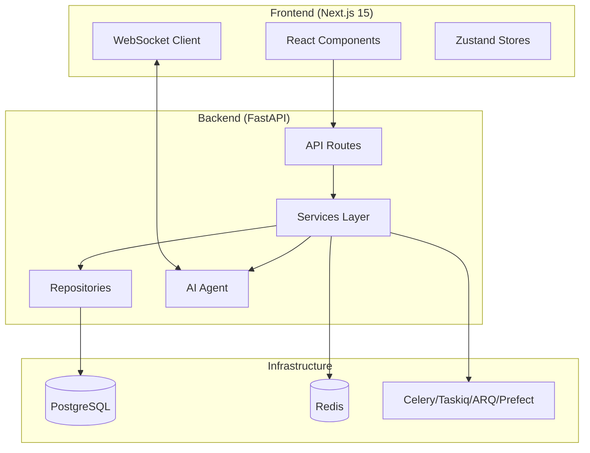

# 核心概念

FastAPI Fullstack 生成的是生产就绪的应用，采用清晰、分层的架构。

## 架构总览



## 关键概念

<div class="grid cards" markdown>

-   :material-layers-outline: **[架构](../architecture.zh.md)**

    ---

    仓储 + 服务模式、依赖注入与分层设计。

-   :material-robot: **[AI 智能体](../ai-agent.zh.md)**

    ---

    PydanticAI、LangChain、LangGraph、DeepAgents,搭配 WebSocket 流式输出。

-   :material-react: **[前端](../frontend.zh.md)**

    ---

    Next.js 15、React 19、TypeScript、Tailwind CSS 与 Zustand。

</div>

## 设计原则

### 1. 关注点分离

每一层都有单一的职责：

| 层 | 职责 |
|-------|---------------|
| **路由(Routes)** | HTTP 处理、校验、认证 |
| **服务(Services)** | 业务逻辑、编排 |
| **仓储(Repositories)** | 数据访问、查询 |

### 2. 依赖注入

FastAPI 的依赖注入系统贯穿始终：

```python
@router.get("/users/{user_id}")
async def get_user(
    user_id: int,
    service: UserService = Depends(get_user_service),
) -> UserResponse:
    return await service.get_user(user_id)
```

### 3. 类型安全

使用 Pydantic 模型做完整的类型标注：

```python
class UserCreate(BaseModel):
    email: EmailStr
    password: str

class UserResponse(BaseModel):
    id: int
    email: EmailStr
    created_at: datetime
```

## 后续步骤

- [架构](../architecture.zh.md) - 深入了解项目结构
- [AI 智能体](../ai-agent.zh.md) - 配置 AI 框架
- [前端](../frontend.zh.md) - 前端架构与模式
